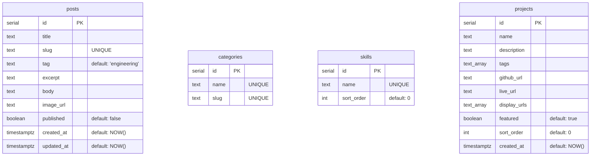

# Cruaz — Product Requirements Document (PRD)

This document provides a detailed breakdown of the current technical specifications, features, schemas, and architecture of the **Cruaz Personal Portfolio & Blog** system. It is designed to serve as a baseline for the planned system redesign (focusing on routing, database connections, and project structure).

---

## 1. Project Overview

The Cruaz website is a personal developer portfolio and technical blog. It enables the user (Cruaz) to:
- Showcase their skill set, bio, and contact information.
- Display a paginated, searchable gallery of completed development and data analysis work/projects.
- Publish and manage blog posts organized by categories.
- Access a secure administrative control panel to manage posts, projects, skills, and categories.

---

## 2. Technical Stack

| Component | Current Technology | Description |
| :--- | :--- | :--- |
| **Frontend** | React (v19), Vite, Vanilla CSS | Single-page application (SPA). Custom state-based routing. |
| **Backend** | Node.js, Express | RESTful API server. Token-based authentication. |
| **Database** | PostgreSQL | Hosted on Neon (serverless Postgres). Connected via `pg.Pool`. |
| **Authentication**| JWT (JSON Web Tokens), `bcryptjs` | Custom middleware validation, 7-day token expiration. |
| **Media Hosting** | Cloudinary | Admin uploads images directly through API stream to Cloudinary. |
| **Contact Form**  | FormSubmit.co AJAX API | Processes messages and forwards to personal email. |
| **Deployment**    | Vercel | Configured with rewrite rule to forward requests to the SPA root. |

---

## 3. Architecture & Routing

### 3.1 Frontend Routing (SPA)
Currently, frontend routing is handled via a **custom state-based routing system** in [src/App.jsx](file:///d:/Website/Blog/src/App.jsx) rather than a library like `react-router-dom`.
- **Mechanism**: Renders components conditionally based on a `page` state.
- **URL Synchronization**: Uses `window.history.pushState` inside a custom navigation helper `go(page, postObj)` to modify the path in the address bar.
- **History Back/Forward**: Listens to the `popstate` event on window and synchronizes state matching the current pathname slice.
- **Redirect Rewrites**: [vercel.json](file:///d:/Website/Blog/vercel.json) rewrites all incoming paths `/(.*)` to `/index.html` to allow the SPA custom router to handle deep links.
- **Reserved Pages**:
  - `home` (`/` or `/home`)
  - `blog` (`/blog`)
  - `portfolio` (`/portfolio`)
  - `about` (`/about`)
  - `contact` (`/contact`)
  - `admin` (`/admin`)
  - Blog Post Details Page (`/:slug`) - Any path not matching a reserved page is treated as a blog post slug, requesting data from the backend to match it.

### 3.2 Backend Server Routing
The Express app in [server/index.js](file:///d:/Website/Blog/server/index.js) mounts all API endpoints flatly on the global express instance. Database initialization, schema creation, seeding, auth middleware, and endpoints are all defined in a single entry-point file.

---

## 4. Database Schema & Data Models

The database schema is initialized and maintained directly inside [server/index.js](file:///d:/Website/Blog/server/index.js) via raw SQL queries executed on startup.

### 4.1 Tables Definition
1. **`posts`**:
   - `id`: `SERIAL PRIMARY KEY`
   - `title`: `TEXT NOT NULL`
   - `slug`: `TEXT UNIQUE NOT NULL` (used as identifier in public routing)
   - `tag`: `TEXT NOT NULL DEFAULT 'engineering'`
   - `excerpt`: `TEXT`
   - `body`: `TEXT` (stored as HTML structure)
   - `image_url`: `TEXT` (Cloudinary hosted)
   - `published`: `BOOLEAN NOT NULL DEFAULT FALSE`
   - `created_at` / `updated_at`: `TIMESTAMPTZ NOT NULL DEFAULT NOW()`

2. **`categories`**:
   - `id`: `SERIAL PRIMARY KEY`
   - `name`: `TEXT UNIQUE NOT NULL`
   - `slug`: `TEXT UNIQUE NOT NULL`

3. **`skills`**:
   - `id`: `SERIAL PRIMARY KEY`
   - `name`: `TEXT UNIQUE NOT NULL`
   - `sort_order`: `INT NOT NULL DEFAULT 0`

4. **`projects`**:
   - `id`: `SERIAL PRIMARY KEY`
   - `name`: `TEXT NOT NULL`
   - `description`: `TEXT`
   - `tags`: `TEXT[]` (Array of tags, e.g., `['React', 'PostgreSQL']`)
   - `github_url`: `TEXT`
   - `live_url`: `TEXT`
   - `display_urls`: `TEXT[]` (Array of up to 5 screenshot URLs)
   - `featured`: `BOOLEAN NOT NULL DEFAULT TRUE`
   - `sort_order`: `INT NOT NULL DEFAULT 0`
   - `created_at`: `TIMESTAMPTZ NOT NULL DEFAULT NOW()`

---

## 5. API Endpoints

### 5.1 Public Routes (No Authentication Required)
- **`GET /api/health`**
  - Returns `{ "status": "ok" }`.
- **`GET /api/posts`**
  - Returns an array of published posts sorted by `created_at DESC`.
- **`GET /api/posts/:slug`**
  - Returns a single published post corresponding to the provided `:slug`. Returns `404` if not found.
- **`GET /api/categories`**
  - Returns all categories sorted alphabetically by name.
- **`GET /api/skills`**
  - Returns all skills sorted by `sort_order ASC`, then `name ASC`.
- **`GET /api/projects`**
  - Returns only featured projects sorted by `sort_order ASC`, then `created_at DESC`.

### 5.2 Authentication Routes
- **`POST /api/admin/login`**
  - Payload: `{ "username": "...", "password": "..." }`
  - Matches credentials against server environment variables `ADMIN_USERNAME` and `ADMIN_PASSWORD`.
  - Supports raw strings and bcrypt-hashed passwords.
  - Returns a signed JWT: `{ "token": "..." }`.

### 5.3 Administrative Routes (Requires JWT `Authorization: Bearer <token>`)
All administrative requests are validated using the `auth` middleware function.
- **Posts**:
  - `GET /api/admin/posts` - Returns all posts (both published and drafts).
  - `POST /api/admin/posts` - Creates a new post. Checks for slug collision (`409`).
  - `PUT /api/admin/posts/:id` - Updates an existing post. Checks for slug collision (`409`).
  - `DELETE /api/admin/posts/:id` - Deletes a post.
- **Media Upload**:
  - `POST /api/admin/upload` - Single file upload under multipart field `image`. Uses `multer` memory storage and `streamifier` to pipe file buffers directly into Cloudinary's `blog_uploads` folder. Returns `{ "url": "..." }`.
- **Categories**:
  - `POST /api/admin/categories` - Creates a new category. Returns `409` on name/slug duplication.
  - `DELETE /api/admin/categories/:id` - Deletes a category.
- **Skills**:
  - `GET /api/admin/skills` - Returns all skills.
  - `POST /api/admin/skills` - Creates a new skill.
  - `DELETE /api/admin/skills/:id` - Deletes a skill.
- **Projects**:
  - `GET /api/admin/projects` - Returns all projects.
  - `POST /api/admin/projects` - Creates a project.
  - `PUT /api/admin/projects/:id` - Updates a project.
  - `DELETE /api/admin/projects/:id` - Deletes a project.

---

## 6. Frontend Features & User Flows

### 6.1 Layout & Theme
- **Global Layout**: Houses a common navigation bar [src/App.jsx (Nav)](file:///d:/Website/Blog/src/App.jsx#L41) and responsive hamburger menu toggle.
- **Theme Manager**: Dark and light mode toggle that alters CSS variable mappings. Selection is persisted in `localStorage` as `blog_theme`.

### 6.2 Page Details
- **Home**: Renders a bio/hero message, CTA buttons, and a grid showing the 4 most recent blog posts.
- **Writing (Blog)**: Lists all published blog posts with custom search (matching title/excerpt) and tag filters (derived dynamically from categories). Clicking a card redirects to the post page.
- **Work (Portfolio)**: Displays a gallery of featured projects. Supports searching (by project name, tags, description) and paginates items into groups of 4. Renders screenshot slide carousels if `display_urls` are present.
- **About**: Displays standard bio content and lists technologies loaded from `/api/skills`.
- **Contact**: Renders a form supporting two modes: "Collaborate" (reveals project type dropdown and timeline selection) and "Other". Valid submissions are dispatched asynchronously via AJAX to FormSubmit.co.
- **Admin Control Panel**:
  - Accessed via login screen (`/admin`).
  - Features three tabs:
    - **Posts Management**: Table displaying post status. Clicking "Edit" or "New post" opens a workspace supporting title, slug, tag selection, excerpt, and body HTML editor.
    - **Projects Management**: Table listing projects. Includes custom creator supporting up to 5 screenshot uploads, live/GitHub URLs, and order sorting weights.
    - **Settings**: Simple console to quickly add/remove categories and skills.

---

## 7. Analysis & Redesign Suggestions (Connection, Routes, etc.)

The user wants to redesign sections of the app. Below is an architectural analysis of the current structure's pain points and recommended targets for the redesign.

### 7.1 Database Connections & Setup
* **Current Issue**: Database pool setup is loaded globally in [server/db.js](file:///d:/Website/Blog/server/db.js). Furthermore, table creation and migrations are run inline during server bootstrap in [server/index.js](file:///d:/Website/Blog/server/index.js). Seeding script logic is run automatically every start if the row count is zero. This causes coupling between connection management, initialization, and application routing.
* **Redesign Recommendations**:
  - **Isolate Migrations**: Move SQL table creations, migration blocks (like `ALTER TABLE` checks), and seeding scripts into a separate migration directory/files. Run them using a script runner command rather than blocking server startup.
  - **ORM Integration**: Consider switching to Prisma or drizzle-orm to manage schema structure type safety and clean migration execution.
  - **Structured Pools**: Encapsulate DB operations in repository pattern files (`repositories/postsRepository.js`, etc.) instead of executing inline pool queries inside express router handlers.

### 7.2 Routing Structure
* **Current Issue (Backend)**: Single-file backend structure. [server/index.js](file:///d:/Website/Blog/server/index.js) contains ~430 lines of code. Public routes, auth, validation middlewares, admin operations, and server settings are intermixed.
* **Current Issue (Frontend)**: Custom router in [src/App.jsx](file:///d:/Website/Blog/src/App.jsx) is fragile. Deep nesting, route parameters (sluggish post resolution), pagination state handling, and `popstate` manual synchronization make layout expansions complicated.
* **Redesign Recommendations**:
  - **Express Router**: Partition backend routes into separate router modules under a `routes/` directory (e.g., `routes/auth.js`, `routes/posts.js`, `routes/projects.js`, `routes/skills.js`).
  - **Standard Frontend Router**: Replace the custom state routing logic with `react-router-dom` or TanStack Router. This provides:
    - Dedicated `<Routes>` or file-based routing.
    - Proper path matching and variable params (e.g. `/blog/:slug`).
    - Standard navigation lifecycle hooks (`useNavigate`, `useParams`, `useLocation`).
    - Clean loader/data fetching integrations.

### 7.3 Code Organization
* **Current Issue**: [src/App.jsx](file:///d:/Website/Blog/src/App.jsx) is an oversized file (~1050 lines) containing almost all core components (`Nav`, `Home`, `Blog`, `Post`, `Portfolio`, `About`, `Contact`, `AdminPanel`, `ProjectsAdmin`, `SettingsPanel`). This reduces testability, readability, and modularity.
* **Redesign Recommendations**:
  - Split pages into their own component folders (e.g., `src/pages/Home.jsx`, `src/pages/Blog.jsx`, `src/pages/Admin/`).
  - Extract common reusable components like the loading spinner (`Loader`), input components, or icon mappings into `src/components/`.
  - Isolate API client requests into a unified services layer (e.g., `src/services/api.js`).
